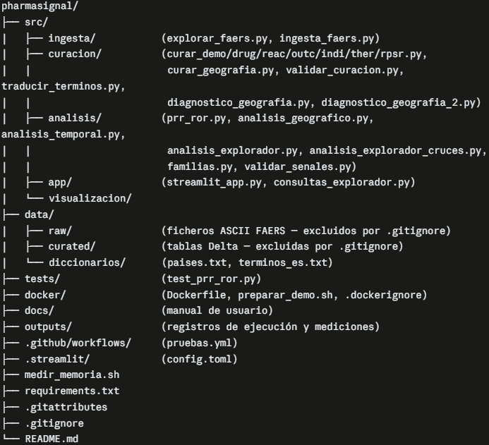

# PharmaSignal

Sistema de detección de señales de farmacovigilancia sobre datos FAERS (2020–2025)

## Descripción
PharmaSignal es un sistema de análisis de datos masivos que explota la base pública de reacciones adversas
de la FDA (FAERS en el periodo 2020–2025) para detectar señales de farmacovigilancia sobre más de 146 millones de registros. 
Aplica las medidas de desproporción PRR y ROR con especial foco en la dimensión geográfica, 
y presenta los resultados en una interfaz para usuarios expertos y no expertos. 
Es una herramienta de apoyo al profesional y no sustituye en ningún caso el criterio clínico.

## Fuente de datos
FAERS (FDA Adverse Event Reporting System), 2020–2025, vía ficheros ASCII + OpenFDA API.

## Stack
- Python 3.12 · PySpark 4.1.1 · Delta Lake 4.3.1 · Pandas 3.0.3
- scikit-learn 1.9.0 (Isolation Forest, E3) · Streamlit 1.59.1 · Docker (E3)
- Entorno: WSL2 Ubuntu 24.04

## Estructura del proyecto


## Ejecución
```bash
# 1. Entorno
python -m venv .venv && source .venv/bin/activate
pip install -r requirements.txt

# 2. Pipeline (necesario seguir este órden específico)
python src/ingesta/ingesta_faers.py
python src/curación/curar_drug.py
python src/curación/curar_reac.py
python src/curación/curar_outc.py
python src/curación/curar_indi.py
python src/curación/curar_ther.py
python src/curación/curar_rpsr.py
python src/curación/validar_curacion.py
python src/analisis/prr_ror.py
python src/analisis/análisis_geografico.py
python src/analisis/análisis_temporal.py

# 3. Frontend
streamlit run src/app/streamlit_app.py
```

## Nota
Los datos de FAERS (~1,5 GB descomprimidos) quedan excluidos del repositorio mediante `.gitignore` por su volumen; se descargan del portal público de la FDA.

## Aviso
Una señal estadística es una hipótesis de trabajo, no una prueba de causalidad.

## Autor
Santos Gómez Gómez
